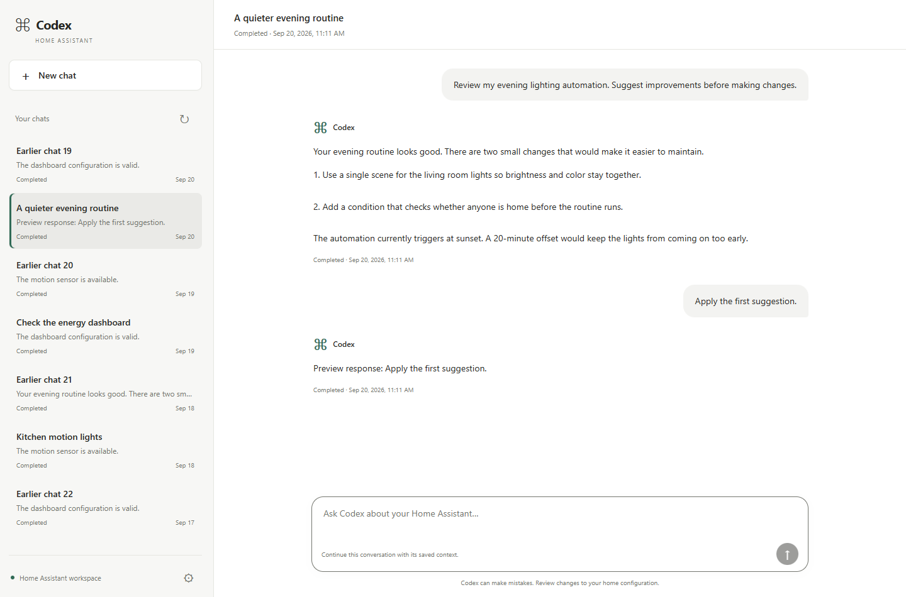
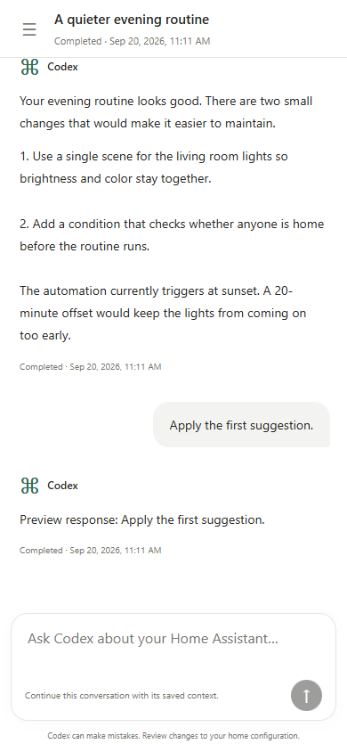
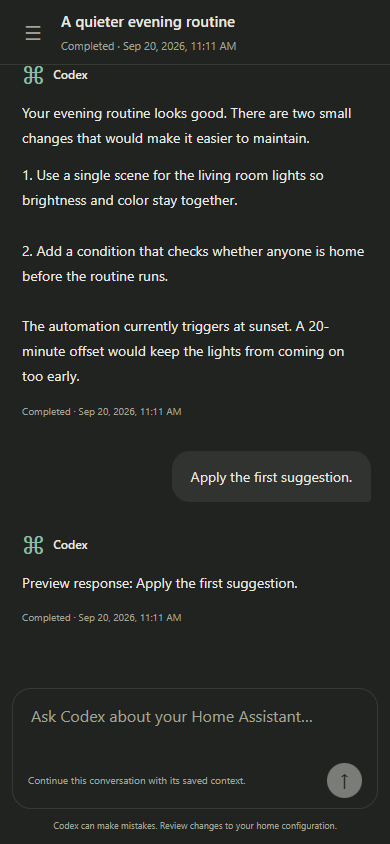
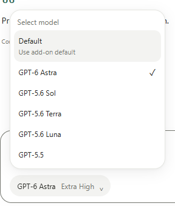
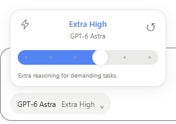
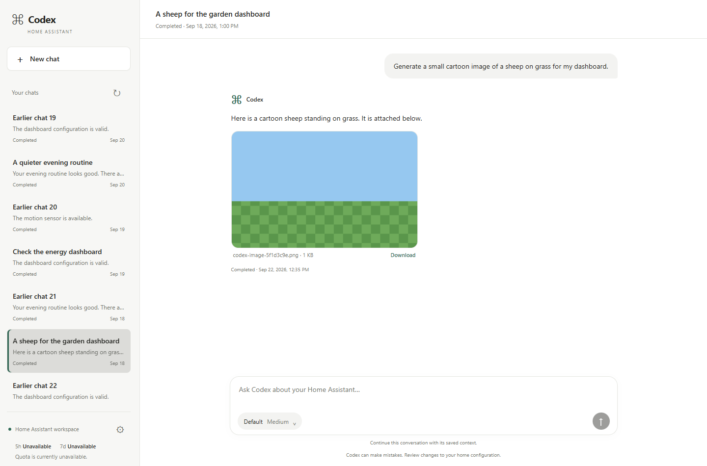

# Codex for Home Assistant

[![Release][release-badge]][release-url]
[![HACS][hacs-badge]][hacs-url]
[![License][license-badge]][license-url]

---

## ❤️ Help support this project

If this project is useful to you, you can support my work:

<p>
  <a href="https://ko-fi.com/Y5B124NZ2L"></a>
  &nbsp;
  <a href="https://github.com/sponsors/moryoav"></a>
</p>

---

Run Codex CLI against your Home Assistant configuration folder from Home Assistant.

## Example Flow

Ask Home Assistant Assist to make a configuration or dashboard change:

![Home Assistant Assist starting a Codex task to update a dashboard card label][assist-screenshot]

Codex runs the task and sends a Home Assistant notification when it finishes:

![Home Assistant persistent notification confirming a completed Codex task][notification-screenshot]

## Conversations

Open the worker web UI to browse saved chats in the left sidebar. Select a chat to read its messages and continue with the same Codex context, or choose **New chat** to start a separate conversation. Drag the sidebar divider to resize it, or focus it and use the arrow keys. On phones, use the menu button to open the chat list. Account sign-in and the AGENTS.md editor are under **Settings**.

The sidebar shows recently active chats first and includes **Load older chats**. Messages, responses, and per-exchange results are saved across worker restarts. Older tasks remain available, but responses overwritten before this feature was added cannot be recovered by the new history view.

### Chat UI preview

Screenshots use demo conversations from the local test fixture.



<p>
  
  
</p>

<p>
  
  
</p>



This repository contains two pieces:

- `codex-cli-worker`: a Home Assistant app/add-on that runs Codex CLI with read-write access to `/config`.
- `custom_components/codex_cli`: a Home Assistant custom integration that exposes entities and actions for starting tasks, checking status, signing in, cancelling work, and continuing saved conversations.

## What It Does

- Starts Codex tasks from Home Assistant actions, scripts, automations, or Assist/LLM tools.
- Keeps saved conversations so you can return to an earlier chat and continue with its context.
- Provides a chat UI with a resizable sidebar, mobile navigation, and light/dark themes.
- Shows what Codex is doing while it works: reasoning headlines, commands, file edits, searches, and tool calls appear live under your message, with a timer from the moment you send it.
- Asks Home Assistant to check the configuration after YAML edits and fails the task on errors.
- Has Codex save the previous version of each file before changing it, reports changed files that have no saved copy, and removes the copies after a number of days you choose.
- Mounts the Home Assistant config folder as `/config` inside the worker app.
- Runs tasks non-interactively and stores task logs/results under `/config/codex_tasks`.
- Supports Codex device-code sign-in through Home Assistant persistent notifications.
- Reports active task count, latest task status, auth status, and task-running state.
- Uses Home Assistant Ingress for the app UI; the worker HTTP port is not exposed to the LAN.
- Inspects dashboards in a real browser at desktop and mobile sizes, with screenshots and check results in the conversation.
- Fetches fresh entity states, checks saved dashboard configuration, and reads Core logs to help verify changes and diagnose problems.

## Dashboard browser verification

By toggling the option **Enable built-in browser** to ON, Codex can open your Home Assistant dashboards in a real browser, capture desktop and mobile screenshots, and inspect them while working on a change. It can use those images to review the layout and revise its work. Screenshots and check results appear with the conversation, including missing cards, failed resources, and browser errors.

The bundled browser signs in automatically with a temporary, local, read-only identity. No Home Assistant password or manually created token is needed. 

## Security Notes

This app is powerful by design. It gives Codex access to your Home Assistant config folder so it can edit automations, scripts, dashboards, integrations, and related files.

The packaged worker follows the current Home Assistant app security guidance:

- No published LAN port.
- Ingress enabled for the web UI.
- Exact Ingress proxy source validation.
- Token-protected worker API for non-Ingress calls.
- AppArmor enabled with a custom profile.
- Bubblewrap namespace setup is isolated in a nested AppArmor profile, and
  sandboxed commands start with all Linux capabilities dropped.
- No Docker API access.
- No host network.
- No host PID/UTS access.
- No `full_access`.
- No elevated Supervisor role.

The `/config` mount is intentionally read-write because editing Home Assistant configuration is the core purpose of the project.

## Disclaimer

Use this project at your own risk. Codex for Home Assistant can read and modify your Home Assistant configuration, dashboards, scripts, automations, and related files. AI-generated changes can be incomplete, incorrect, unsafe, or incompatible with your setup.

You are solely responsible for reviewing changes, keeping backups, testing safely, and deciding whether to run this tool in your environment. The maintainer is not responsible or liable for damage, data loss, service interruption, security issues, misconfiguration, broken automations, device behavior, or any other loss or claim arising from installing, configuring, or using this project.

This project is provided "as is", without warranty of any kind, express or implied. See the repository license for the full warranty and liability disclaimer.

## Supported Architectures

Prebuilt app images are published for:

- `amd64`
- `aarch64`

## Installation

### 1. Add the Worker App Repository

[](https://my.home-assistant.io/redirect/supervisor_add_addon_repository/?repository_url=https%3A%2F%2Fgithub.com%2Fmoryoav%2Fhome-assistant-codex)

Use the button above to add this repository to Home Assistant's Apps store.

If you prefer to do it manually:

In Home Assistant:

1. Go to **Settings** -> **Apps**.
2. Select **Install app**.
3. Open the menu in the top right.
4. Choose **Repositories**.
5. Add this repository URL:

```text
https://github.com/moryoav/home-assistant-codex
```

### 2. Install and Start the Worker App

[](https://my.home-assistant.io/redirect/supervisor_addon/?addon=8a8d906b_codex_cli_worker&repository_url=https%3A%2F%2Fgithub.com%2Fmoryoav%2Fhome-assistant-codex)

Use the button above after adding the repository. It opens the **Codex CLI Worker** app page.

1. Install **Codex CLI Worker**.
2. Review the app options.
3. Start the app.

The app keeps an internal worker API token in private app storage. The **Codex** integration provisions and rotates that token automatically through Home Assistant's Supervisor-managed app stdin, so you do not need to view, copy, or configure a token.

The app's web UI is available through Home Assistant Ingress. Do not try to open port `9123` directly; it is intentionally not exposed.

The app options include dropdowns for the Codex model and model reasoning effort. The default model selection lets the installed Codex CLI choose its current recommended model. You can also select GPT-6 Astra, GPT-6.1 Sol, GPT-6 Sol, or GPT-6 Luna, or the older GPT-5.6 Sol, Terra, or Luna explicitly. The retired GPT-5.5 choice stays in the list so that existing setups keep starting, and runs GPT-5.6 Sol. Model availability depends on your account. `medium` reasoning is the default balance; `high` and `xhigh` can spend more time/quota. For GPT-6 Astra, GPT-6.1 Sol, GPT-6 Sol, and GPT-6 Luna, select `low`, `medium`, `high`, or `xhigh`. `minimal` is not supported by the current models and runs `medium`. The `reasoning_summary` option controls whether Codex reports its reasoning in the chat's activity list: `concise` headlines by default, `detailed`, or `none`. The `config_check` option, on by default, has Home Assistant check its configuration after a task changes YAML files; a failing check fails the task and points to the saved previous version of the affected files. Codex saves a copy of each file before changing it; the `backup_retention_days` option, 7 by default, sets how long these copies are kept, and the `full_snapshot` option, off by default, also archives the whole configuration folder before every message and supplies the previous version of any file Codex did not copy.

The app web UI can view and save `/config/AGENTS.md`. You can also set the masked `HA_TOKEN` option when Codex tasks need a Home Assistant token in their environment.

### 3. Sign In to Codex

Before starting sign-in, enable **Enable device code authorization for Codex** in ChatGPT:

1. Open the ChatGPT website.
2. Click your profile.
3. Go to **Settings** -> **Security**.
4. Turn on **Enable device code authorization for Codex** near the bottom of the page.

This setting is in ChatGPT, not the Codex website.

Open the app web UI and click **Start login**, or call the `codex_cli.start_login` action after the integration is installed.

The app sends a Home Assistant persistent notification with:

- A QR code.
- A sign-in link.
- The one-time device code.

Scan the QR code or open the link, then enter the device code shown in the notification.

Codex CLI sign-in uses your ChatGPT/OpenAI account. It may work with a free ChatGPT account, but **ChatGPT Plus or higher is recommended** for more reasonable usage limits. This project does not use OpenAI API keys for Codex tasks.

### 4. Install the Integration

#### HACS

[](https://my.home-assistant.io/redirect/hacs_repository/?owner=moryoav&repository=home-assistant-codex&category=integration)

Codex is available in the default HACS catalog, so no custom repository setup is required.

1. Select the button above, or open HACS and search for **Codex** under **Integrations**.
2. Select **Codex** and choose **Download**.
3. Restart Home Assistant.

#### Manual

Copy:

```text
custom_components/codex_cli
```

to:

```text
/config/custom_components/codex_cli
```

Then restart Home Assistant.

### 5. Add the Integration

[](https://my.home-assistant.io/redirect/config_flow_start/?domain=codex_cli)

Use the button above after Home Assistant restarts. It opens the **Codex** integration setup flow.

In Home Assistant:

1. Go to **Settings** -> **Devices & services**.
2. Add integration **Codex**.

The integration auto-detects the installed worker app and provisions its internal worker API token. There is no worker URL or API token to enter.

## Actions

The integration exposes these Home Assistant actions:

- `codex_cli.start_task`
- `codex_cli.start_login`
- `codex_cli.logout`
- `codex_cli.get_login_status`
- `codex_cli.list_tasks`
- `codex_cli.get_task`
- `codex_cli.cancel_task`
- `codex_cli.reply_task`
- `codex_cli.continue_task`

The integration also provides diagnostic sensors for auth status, active tasks, last task, and the usage windows reported by Codex `/status`. Depending on the account and plan, Codex may report both 5-hour and weekly limits or only a weekly limit. The existing 5-hour entities remain available for automation compatibility; when that window is omitted their state is `unknown` and their `reported` attribute is `false`. Reported usage sensors expose numeric percent states plus ISO datetime reset attributes when reset times are present.

When a Codex task completes, fails, or needs input, the worker fires a Home Assistant event named `codex_cli_task_result` in addition to the notification. Automations can listen for that event and read fields such as `task_id`, `status`, `summary`, `question`, `details`, `attachments`, and the nested `response` object from `trigger.event.data`.

Example:

```yaml
action: codex_cli.start_task
data:
  prompt: Check my Home dashboard for broken cards and suggest fixes.
response_variable: codex_result
```
### Home Assistant actions

List the 10 most recently active tasks:

```yaml
action: codex_cli.list_tasks
data:
  limit: 10
  order: updated_desc
  summary: true
response_variable: recent_chats
```

Optional filters are `limit` (1–500), `offset` (zero-based), `status`, `order` (`created_asc` or `updated_desc`), and `summary`. The response includes `tasks`, `total`, `next_offset`, and `active_task_id`. With no options, the action keeps returning all tasks, oldest-created first. Use `codex_cli.get_task` with a `task_id` to retrieve the full conversation in `task.turns`.

Continue a previous task:

```yaml
action: codex_cli.continue_task
data:
  task_id: "YOUR_TASK_ID"
  message: "Apply the first suggestion from your previous answer."
response_variable: continued_chat
```

Completed, failed, cancelled, and waiting tasks can continue if their saved Codex session is available. The task ID stays the same. Each message adds a new exchange, and the task-level status and result describe the latest exchange. Only one task can run at a time. A missing session produces an error instead of silently starting a new conversation.

The existing `codex_cli.reply_task` action still answers tasks waiting for input. New tasks do not automatically inherit context from other chats.

## Task Output

Codex tasks return a structured response with `status`, `summary`, `question`, and `details`. These values are plain strings, and how they are displayed depends on the Home Assistant consumer or notification service that receives them.

You can request a preferred output style through `/config/AGENTS.md`, which is editable from the worker app web UI. Codex treats this as guidance rather than a formatting guarantee. If you want Markdown-friendly task output, you can add this instruction:

```md
For the final structured response, use concise Markdown in summary, question,
and details when it improves readability. Use only short lists, emphasis, inline
code, and fenced code blocks. Do not use raw HTML, images, or embedded content.
```

## Assist / LLM Script Example

See [examples/scripts.yaml](examples/scripts.yaml) for a starter script you can expose to Assist or another LLM integration.

## Community-Created Cards

Community-created dashboard cards are maintained in their own repositories:

- [Home Assistant Codex Card](https://github.com/Rschmidt79/home-assistant-codex-card) by [Rschmidt79](https://github.com/Rschmidt79), a Lovelace chat card for starting and following Codex tasks from a Home Assistant dashboard.

## Stable And Dev Branches

Use the default repository URL for stable releases:

```text
https://github.com/moryoav/home-assistant-codex
```

The `dev` branch can be used for optional worker app development and canary builds:

```text
https://github.com/moryoav/home-assistant-codex#dev
```

The `#dev` URL applies to the worker app repository. HACS installs the
integration from the ZIP attached to a release. To test integration changes
from a development branch, use the manual installation instructions above.

## Publishing Images

The repository includes a GitHub Actions workflow that builds and publishes multi-architecture images to GitHub Container Registry:

```text
ghcr.io/moryoav/codex-cli-worker
```

The app `config.yaml` points at that image. Home Assistant uses the app version as the image tag.

Release builds also publish the `latest` image tag. Manual workflow builds from development branches publish the app version and branch name tags, but do not move `latest`.

To prepare a release, set the same version in `codex-cli-worker/config.yaml`
and `custom_components/codex_cli/manifest.json`, and add its notes to
`codex-cli-worker/CHANGELOG.md`. After merging and checking CI, push a
`vX.Y.Z` tag for that commit. The release workflow validates the repository,
attaches `codex_cli.zip`, and publishes the worker images. Release packaging
rejects mismatched versions and missing changelog notes.

## Development Layout

```text
.
├── codex-cli-worker/
│   ├── config.yaml
│   ├── Dockerfile
│   ├── server.py
│   └── ...
├── custom_components/
│   └── codex_cli/
├── examples/
├── repository.yaml
└── hacs.json
```

[assist-screenshot]: https://raw.githubusercontent.com/moryoav/home-assistant-codex/main/examples/codex-1.JPG
[notification-screenshot]: https://raw.githubusercontent.com/moryoav/home-assistant-codex/main/examples/codex-2.JPG
[hacs-badge]: https://img.shields.io/badge/HACS-41BDF5.svg?style=flat-square
[hacs-url]: #installation
[release-badge]: https://img.shields.io/github/v/release/moryoav/home-assistant-codex?style=flat-square
[release-url]: https://github.com/moryoav/home-assistant-codex/releases/latest
[license-badge]: https://img.shields.io/github/license/moryoav/home-assistant-codex?style=flat-square
[license-url]: https://github.com/moryoav/home-assistant-codex/blob/main/LICENSE
