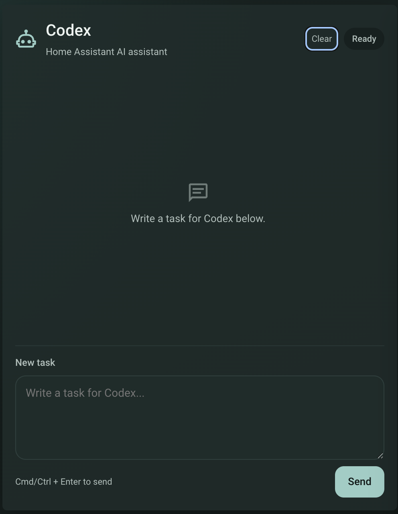
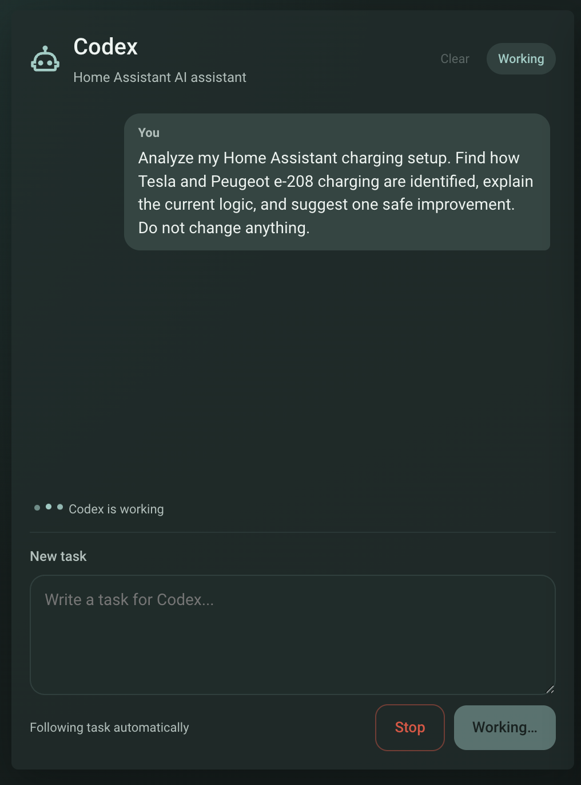
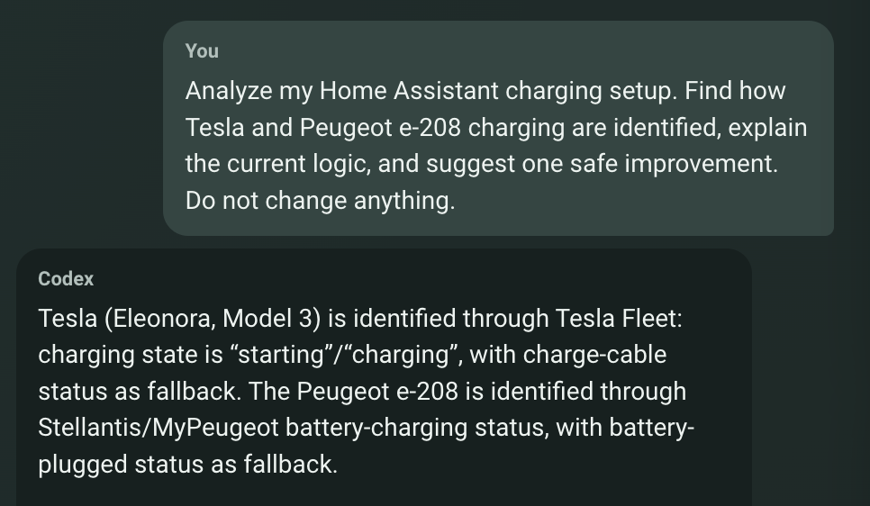

# Codex Prompt Card

`codex-prompt-card.js` is an optional Lovelace chat UI example for the existing Codex Home Assistant integration. It starts Codex tasks, follows their progress, displays their full result details, and lets you reply when Codex needs human input.

This card is not required by the integration and does not replace or modify any integration or worker behavior.

## Prerequisites

- Codex CLI Worker is already installed, configured, and authenticated.
- The Codex integration is already installed and configured in Home Assistant.

## Installation

1. Copy `codex-prompt-card.js` to:

   ```text
   /config/www/codex-prompt-card.js
   ```

2. In Home Assistant, open **Settings → Dashboards → Resources**, add the following resource, and select **JavaScript module**:

   ```text
   /local/codex-prompt-card.js
   ```

3. Add the card to a Lovelace dashboard using YAML:

   ```yaml
   type: custom:codex-prompt-card
   ```

   An optional title can be configured:

   ```yaml
   type: custom:codex-prompt-card
   title: Home Assistant Codex
   ```

If the card does not appear after installation, reload the dashboard without using the browser cache.

## Features

- Starts a task with the existing `codex_cli.start_task` service.
- Polls progress with `codex_cli.get_task` and retries temporary connection failures.
- Shows the full `task.details` result when available, with selectable and copyable text.
- Shows task state as **Ready**, **Working**, **Waiting**, **Error**, or **Stopping**.
- Accepts replies through `codex_cli.reply_task` when a task is waiting for input.
- Stops an active task by calling `codex_cli.cancel_task`.
- Restores the current/latest locally remembered task after a dashboard reload, including resuming polling for work still in progress and restoring Reply mode when input is needed.
- Supports long multiline prompts and sends with **Ctrl+Enter** or **Cmd+Enter**.
- Keeps the conversation at a fixed, scrollable height and automatically scrolls to new messages.
- Uses Home Assistant theme variables and adapts to mobile screens.
- Has no external dependencies.

**Clear** only clears this card's local conversation and remembered task ID. It does not delete, cancel, or otherwise change tasks in the worker. **Stop** is different: it calls `codex_cli.cancel_task` for the active task.

The card communicates exclusively through the existing official integration services. It is an optional example UI and is not required to install or use the Codex integration.

## Screenshots

Ready state:



Running task with the Stop control visible:



Completed task with a Codex response:


